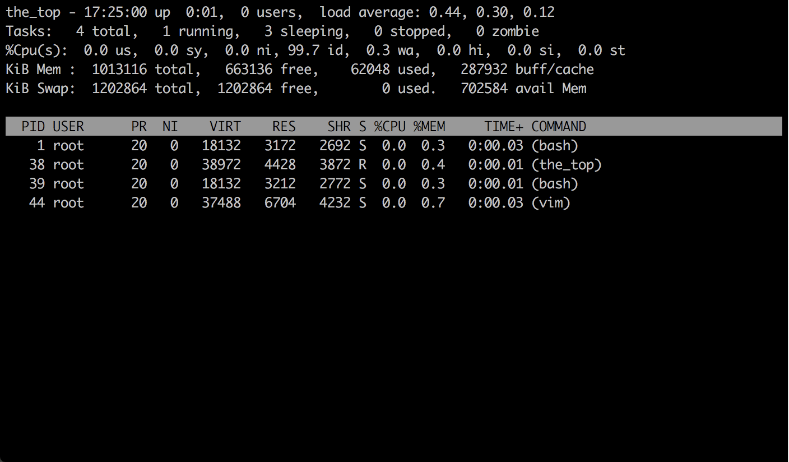
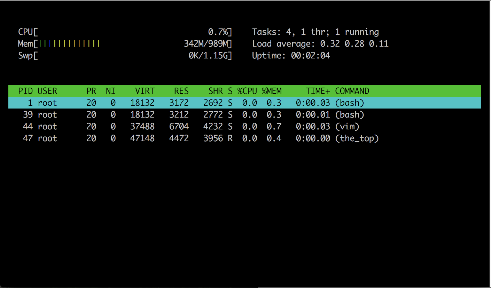
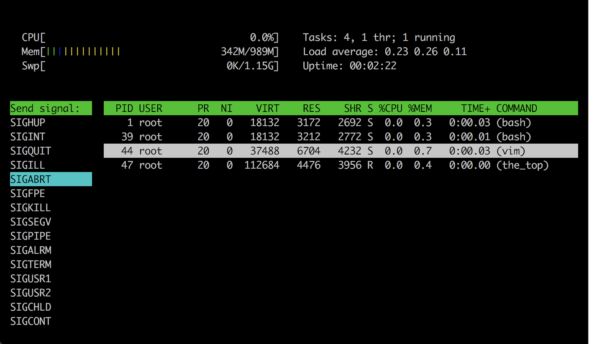

# the_top
My simple version of `top` and `htop` linux utils.





### Requirements
Cmake, Ncurses, Gcc

### How to build
```
mkdir build && cd build && cmake .. && make
```

### How to run
```
./the_top
```
or
```
./the_top --htop
```
To make it look properly enter this line in a shell
```
export TERM=xterm-256color
```
Press `UP/DOWN-arrow` key to move through processes.

Press `q` to exit.

In `htop` mode you can send signals to a selected process
just press a `k` button, select with arrow keys a needed signal
and press an `Enter`.

To close the signals window press `q`.
